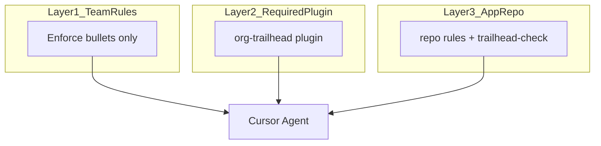

# Rule layering — where does a new rule go?

## Three layers



| Layer | Mechanism | Examples |
|-------|-----------|----------|
| **1. Team Rules** | Dashboard, enforced | No external code; approved packages only |
| **2. Required plugin** | Team Marketplace | `python-base.mdc`, `/welcome-onboard`, `/pm-plan-change` |
| **3. App repo** | Git in library repo | `repo-core-conventions.mdc`, `/scaffold-first-contribution`, `deprecated-apis.json` |

**Precedence:** Team Rules → plugin → project rules.

## Decision tree

```
Is it non-negotiable for every repo and must never be disabled?
  YES → Team Rules (short bullet)
  NO ↓

Is it company-wide Python/security convention?
  YES → Plugin repo rule or skill
  NO ↓

Is it specific to this library (paths, deprecated APIs, test layout)?
  YES → App repo rule, JSON config, or trailhead-check.py
```

## MR visibility

- **Plugin change** → plugin repo PR + semver release
- **App adoption** → bump `trailhead-manifest.json` `company_plugin.version` in app repo PR

Reviewers see manifest bumps without duplicating company rules in every app repo.

## What not to do

- Do not copy plugin rules into `.cursor/rules/company-*` in app repos
- Do not put full style guides in Team Rules dashboard
- Do not duplicate Ruff checks in `trailhead-check.py` — their CI owns generic lint
